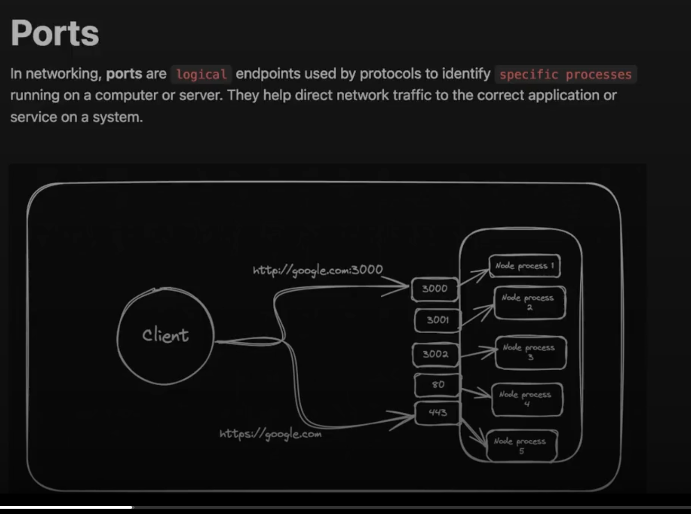

node js is a run time that allow to excute js code on the server side . 
it is built chrome v8 engine 
sever means my machine
v8 engine is core engine which interperate the javascript 
# first of all init the node.js
steps
npm init -y

# npm is node package manager 
it is a package manager for js , primarily used for managing libraries and dependicies in node.js project.
npm allow developers to easily install , update , manage package of resuable code 
# to install 
npm init 
# running script 
npm run test 
# installing extra dependencies 
npm install chalk 
 # Internal packages

Node.js provides you some `packages` out of the box. Some common ones include

1. fs - Filesystem
2. path - Path related functions
3. http - Create HTTP Servers (we’ll discuss this tomorrow)

### fs package

The fs (Filesystem) package is used to read, write, update contents on the filesystem.

```jsx
const fs = require('fs');
const path = require('path');

const filePath = path.join(__dirname, 'a.txt');

fs.readFile(filePath, 'utf8', (err, data) => {
  if (err) {
    console.log(err);
  } else {
    console.log(data);
  }
});
```

Why use the `path` library?

1. Cross platform joins (Windows has Users\kirat\dir , linux has Users/kirat/dir)
2. Gives you a bunch of helper functions (dirname)
3. Normalises paths (Converts `/Users/kirat/Proejcts/../../Projects` to `/Users/kirat/Projects`

# external package 
the package which written or maintain by other people


# assignments https://petal-estimate-4e9.notion.site/Assignments-1-Create-a-cli-edb2413bc3064646b97ad9a3b57923e0


# HTTPS


### Ports



# now i am writing backend for the todo application 
so first setup the npm init -y
and then express 


Header 
A header is metadata/information about the request or response.


Fetch API 


axios => directly convert the data into the json format 


middlewares
petal-estimate-4e9.notion.site/Middlewares-fOee291bc401438aa183eb137536e944

# in the express , the middlewares refers to the function that access the request object(req),response(res),and the next function in the application request responce cycle 


# now i want that the frontend file is index.html and i want that my frontend is running on the url like backend running something like localhost so 
# steps is here 
#
